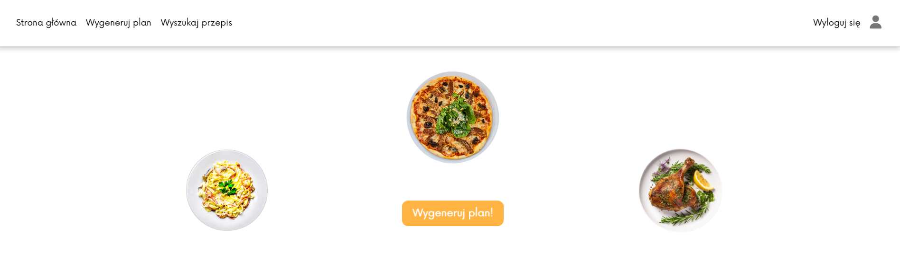

# Meal Planner Web App

## Showcase of the application
[App demo video.](https://youtu.be/G6EI3XY-y6Y)

&nbsp;

## Functionalities

**Meal plan generator**:\
Creating a personalised list of recipes for a specified number of days.
- selecting recipes based on user preferences (diet, owned products, unwanted products)
- converting number of portions
- adjusting to your schedule (e.g. you can choose to cook something for more than one day)
- calculating leftovers and using them in the following days of the plan

**Other features**:
- login and registration
- editing user profile
- adding recipes to favourites
- searching for recipes
- drawing recipes based on diet

&nbsp;

## Technologies
 &nbsp;
 &nbsp;
 &nbsp;
 &nbsp;
 &nbsp;

 &nbsp;
 &nbsp;
 &nbsp;

